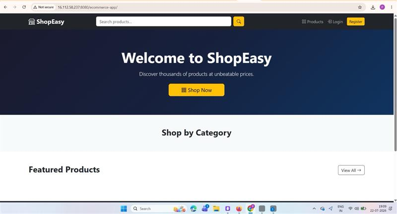
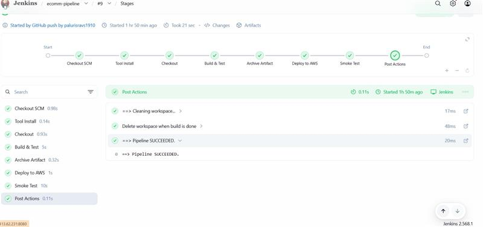
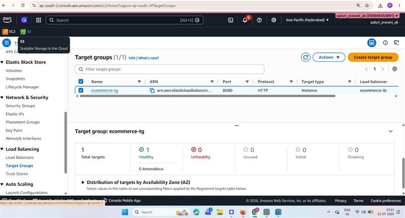

# ShopEasy — E-Commerce Three-Tier CI/CD on AWS


A production-grade e-commerce web application built with **Java Servlets + JSP**, deployed on a
**three-tier AWS architecture**, with a fully automated **Jenkins CI/CD pipeline** triggered on every GitHub push.

---

## Table of Contents

- [Architecture](#architecture)
- [CI/CD Pipeline](#cicd-pipeline)
- [Tech Stack](#tech-stack)
- [Features](#features)
- [Project Structure](#project-structure)
- [AWS Infrastructure](#aws-infrastructure)
- [Quick Start](#quick-start)
- [Screenshots](#screenshots)
- [Roadmap](#roadmap)
- [Author](#author)

---

## Architecture

```
  Internet
      │
      ▼  HTTP :80
┌──────────────────────────────────┐
│    Application Load Balancer     │
│    ecommerce-alb                 │
│    Health checks → /ecommerce-app│
└──────────────────────────────────┘
      │
      ▼  HTTP :8080 (internal only)
┌─────────────────────────────────────────────────────────┐
│                  AWS VPC  10.0.0.0/16                   │
│                                                         │
│  ┌──────────────────────────────────────────────────┐   │
│  │         Public Subnet  10.0.1.0/24               │   │
│  │                                                  │   │
│  │  ┌─────────────────┐    ┌──────────────────────┐ │   │
│  │  │  Jenkins EC2    │    │    Tomcat EC2         │ │   │
│  │  │  t3.medium      │───▶│    t3.small           │ │   │
│  │  │  CI/CD Server   │    │    App Server         │ │   │
│  │  └─────────────────┘    └──────────────────────┘ │   │
│  └──────────────────────────────────────────────────┘   │
│                                                         │
│  ┌──────────────────────────────────────────────────┐   │
│  │         Private Subnet  10.0.2.0/24              │   │
│  │                                                  │   │
│  │           ┌───────────────────────┐              │   │
│  │           │   AWS RDS MySQL 8.0   │              │   │
│  │           │   Database Tier       │              │   │
│  │           └───────────────────────┘              │   │
│  └──────────────────────────────────────────────────┘   │
└─────────────────────────────────────────────────────────┘
```

---

## CI/CD Pipeline

Every `git push` to `main` automatically triggers the full pipeline:

```
Developer
    │
    │  git push
    ▼
GitHub Repository
    │
    │  Webhook → Jenkins
    ▼
┌─────────────────────────────────────────────┐
│            Jenkins Pipeline                 │
│                                             │
│  Stage 1 → Checkout from GitHub            │
│  Stage 2 → Maven Build & Test              │
│  Stage 3 → Archive WAR Artifact            │
│  Stage 4 → Deploy WAR to Tomcat            │
│  Stage 5 → Smoke Test via ALB DNS          │
└─────────────────────────────────────────────┘
```

**Build time: ~1 minute end to end**

| Stage | Tool | Output |
|---|---|---|
| Checkout | Git | Latest source code |
| Build & Test | Maven 3.9 | ecommerce-app.war (~14MB) |
| Archive | Jenkins | Stored build artifact |
| Deploy | curl + Tomcat Manager API | Live deployment |
| Smoke Test | curl | HTTP 200 verified |

---

## Tech Stack

| Layer | Technology | Version |
|---|---|---|
| Language | Java | 21 |
| Web Framework | Java Servlets + JSP | - |
| Build Tool | Apache Maven | 3.9 |
| Application Server | Apache Tomcat | 9.0.120 |
| Database | MySQL | 8.0 |
| Payment Gateway | Stripe API | 23.3.0 |
| CI/CD | Jenkins | 2.x |
| Load Balancer | AWS ALB | - |
| Cloud | AWS EC2, RDS, VPC, ALB | - |
| Frontend | Bootstrap 5 + JSTL | 5.3 |
| Password Security | BCrypt (jBCrypt) | 0.4 |
| Logging | SLF4J + Logback | 2.0.9 |

---

## Features

- User registration and login with BCrypt password hashing
- Product listing, search, and category filtering
- Shopping cart with real-time quantity management
- Secure checkout with shipping address collection
- Stripe payment integration with real-time card validation
- Order history and detailed order view per user
- Admin panel for product and order management
- Auth filter protecting all secured routes
- Responsive UI with Bootstrap 5
- Custom 404, 403, 500 error pages
- UTF-8 character encoding filter

---

## Project Structure

```
ecommerce-multicloud-three-tier-cicd/
│
├── Jenkinsfile                        # CI/CD pipeline definition
├── pom.xml                            # Maven build configuration
├── README.md                          # Project documentation
├── CHANGELOG.md                       # Version history
├── CONTRIBUTING.md                    # Contribution guide
├── SECURITY.md                        # Security policy
├── LICENSE                            # MIT License
│
├── scripts/                           # Server automation scripts
│   ├── install-jenkins.sh
│   ├── install-tomcat.sh
│   └── db-setup.sh
│
├── docs/                              # Detailed documentation
│   ├── setup-guide.md
│   ├── ci-cd-pipeline.md
│   ├── alb-setup.md
│   └── infrastructure.md
│
├── screenshots/                       # Project screenshots
│   ├── app-ui/
│   ├── jenkins-pipeline/
│   ├── aws-infrastructure/
│   └── kiro-ai/
│
└── src/main/
    ├── java/com/ecommerce/
    │   ├── controller/                # Servlets - HTTP request handling
    │   ├── dao/                       # Database access layer
    │   ├── filter/                    # Auth + encoding filters
    │   ├── model/                     # Domain models
    │   ├── service/                   # Business logic layer
    │   └── util/                      # DB connection + config
    ├── resources/
    │   ├── db.properties.example      # Config template
    │   └── schema.sql                 # MySQL schema + seed data
    └── webapp/
        ├── WEB-INF/
        │   ├── web.xml
        │   └── views/                 # JSP pages
        └── css/style.css
```

---

## AWS Infrastructure

| Resource | Name | Value |
|---|---|---|
| VPC | ecommerce-vpc | 10.0.0.0/16 |
| Public Subnet 1 | ecommerce-public-subnet | 10.0.1.0/24 — ap-south-2a |
| Public Subnet 2 | ecommerce-public-subnet-2 | 10.0.3.0/24 — ap-south-2b |
| Private Subnet | ecommerce-private-subnet | 10.0.2.0/24 — ap-south-2a |
| Internet Gateway | ecommerce-igw | Attached to VPC |
| Jenkins EC2 | jenkins-server | t3.medium — Elastic IP |
| Tomcat EC2 | tomcat-server | t3.small — Elastic IP |
| Load Balancer | ecommerce-alb | Internet-facing — Port 80 |
| Target Group | ecommerce-tg | Port 8080 — Health: /ecommerce-app/ |
| Database | ecommerce-db | RDS MySQL 8.0 — Private subnet |

### Security Groups

| SG | Port | Source | Purpose |
|---|---|---|---|
| alb-sg | 80 | 0.0.0.0/0 | Public HTTP via ALB |
| jenkins-sg | 8080 | 0.0.0.0/0 | Jenkins UI |
| jenkins-sg | 22 | My IP | SSH only |
| tomcat-sg | 8080 | alb-sg | App via ALB only |
| tomcat-sg | 22 | My IP | SSH only |
| rds-sg | 3306 | tomcat-sg | DB from app only |

---

## Quick Start

### 1. Clone the Repository
```bash
git clone https://github.com/palurisravs1910/ecommerce-multicloud-three-tier-cicd.git
cd ecommerce-multicloud-three-tier-cicd
```

### 2. Configure Database
```bash
cp src/main/resources/db.properties.example src/main/resources/db.properties
# Edit db.properties with your RDS endpoint and credentials
```

### 3. Initialize Database
```bash
bash scripts/db-setup.sh <RDS-ENDPOINT> admin
```

### 4. Setup Jenkins Server
```bash
bash scripts/install-jenkins.sh
```

### 5. Setup Tomcat Server
```bash
bash scripts/install-tomcat.sh
```

### 6. Build Manually (optional)
```bash
mvn clean package -DskipTests
```

For complete step-by-step instructions see [Setup Guide](docs/setup-guide.md).

---

## Documentation

| Document | Description |
|---|---|
| [Setup Guide](docs/setup-guide.md) | Complete step-by-step AWS setup |
| [CI/CD Pipeline](docs/ci-cd-pipeline.md) | Pipeline stages and configuration |
| [ALB + RDS Setup](docs/alb-setup.md) | Load balancer and database setup |
| [Infrastructure](docs/infrastructure.md) | AWS resource reference |

---

## Screenshots

### Application UI


### Jenkins CI/CD Pipeline


### AWS Target Group Health check


---

## Roadmap

- [x] Three-tier VPC architecture on AWS
- [x] Jenkins CI/CD pipeline with GitHub webhook auto-trigger
- [x] Maven build + WAR deployment to Tomcat
- [x] Application Load Balancer with health checks
- [x] Elastic IPs for stable server addressing
- [x] Stripe payment integration
- [x] BCrypt password security
- [x] AWS RDS MySQL (managed database tier)
- [x] Nginx reverse proxy with HTTPS (self-signed SSL)
- [ ] Azure VM deployment (multi-cloud)
- [ ] HTTPS with ACM (requires custom domain)

---

## Author

**Sravani Paluri**
DevOps | Cloud | Java

[](https://github.com/palurisravs1910)

---

*AI-assisted development tools were used to accelerate documentation and automation tasks.
All infrastructure setup, validation, and deployment were implemented and verified by the author.*
